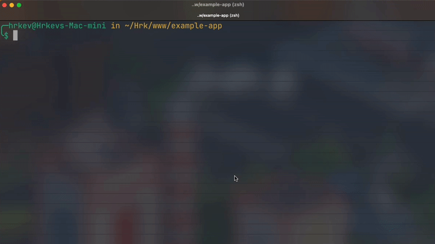

# Artisan Finder


[](https://packagist.org/packages/binafy/artisan-finder)
[](https://packagist.org/packages/binafy/artisan-finder)
[](https://packagist.org/packages/binafy/artisan-finder)
[](https://packagist.org/packages/binafy/artisan-finder)
[](https://github.com/binafy/artisan-finder/actions/workflows/tests.yml)

<a name="introduction"></a>
## Introduction

Artisan Finder is a Laravel package that introduces a convenient command called `find:art`. This command provides an interactive select input, allowing you to quickly search through available artisan commands and execute them immediately. It's designed to enhance your workflow by making it easier to locate and run artisan commands without the need to remember exact command names, offering a faster and more efficient development experience.

<a name="installation"></a>
## Installation

You can install the package with Composer:

```bash
composer require binafy/artisan-finder --dev
```

> **_NOTE:_** We suggest to install the package in development mode.

<a name="how-to-work"></a>
## How to Work

For working with `Artisan Finder`, you can just run below command on your terminal:

```shell
php artisan find:art
```

When you run this command, this command show you a search box, and you can search your command and run it immediately:



> **_NOTE:_** Thank you [Hamid-Reza Khosravi](https://github.com/hrk-ir) for creating this video.

<a name="contributors"></a>
## Contributors

Thanks to all the people who contributed. [Contributors](https://github.com/binafy/artisan-finder/graphs/contributors).

<a href="https://github.com/binafy/artisan-finder/graphs/contributors"></a>

<a name="security"></a>
## Security

If you discover any security-related issues, please email `binafy23@gmail.com` instead of using the issue tracker.

<a name="chanelog"></a>
## Changelog

The changelog can be found in the `CHANGELOG.md` file of the GitHub repository. It lists the changes, bug fixes, and improvements made to each version of the `Artisan Finder` package.

<a name="license"></a>
## License

The MIT License (MIT). Please see [License File](https://github.com/binafy/artisan-finder/blob/1.x/LICENSE) for more information.
